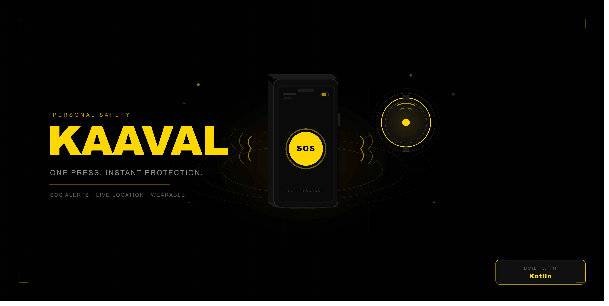

# KAAVAL

**Accessibility-First Emergency Response Ecosystem for Visually Impaired Individuals**

Supported by the **IEEE Sensors Council Industry Mentoring Program**.

---

## 👁️ Vision
> **Our goal is not to build another emergency app.**
> 
> We are building an **accessibility-first emergency response ecosystem** that enables visually impaired individuals to request help instantly and ensures that caregivers coordinate an effective response until the user is safe.

---

## 🚨 Problem Statement
Visually impaired individuals face three critical challenges during emergencies because existing systems assume users can quickly locate, unlock, and operate a smartphone:

1.  **Emergency Activation**: Locating or operating a digital screen during a high-stress crisis is nearly impossible without sight.
2.  **Response Assurance**: After triggering an SOS, users often have zero feedback on whether help is actually coming, leading to extreme anxiety.
3.  **Caregiver Coordination**: Multiple family members may receive alerts simultaneously, but without coordination, response is often delayed or redundant.

---

## 🛡️ Our Solution: The SAHAAYA Ecosystem
KAAVAL (Sahaaya) manages the **complete emergency response workflow** — from instant activation to caregiver acknowledgement and incident closure.

> **The Differentiator**: While standard systems send a message, **KAAVAL coordinates the response.**

### Ecosystem Components:
- ⌚ **Tactile Wearable**: A Bluetooth-enabled locket with a dedicated SOS button and haptic feedback.
- 📱 **User Application**: A voice-first, high-contrast Android app optimized for TalkBack and gesture control.
- 👨‍👩‍👧 **Caregiver Network**: A coordination platform for family, NGOs, and mentors to acknowledge alerts and track live ETA.
- ☁️ **Cloud Coordination**: A real-time engine managing incident state and caregiver routing.

---

## 👥 Target Users

### Primary Users
*   **Visually Impaired Individuals**: Students and adults who require a reliable, non-visual way to call for help.

### Secondary Users (Responders)
*   **Family & Caregivers**: Immediate emergency contacts.
*   **Educational Institutions**: Schools and NGOs for the visually impaired.
*   **Security Teams**: Campus security or local first responders.

---

## 🌐 Live Web Ecosystem Deployment
- 📱 **Live Interactive Web Simulator**: [https://kaaval-94c1d.web.app](https://kaaval-94c1d.web.app)
- 📡 **Caregiver Live Location Portal**: [https://kaaval-94c1d.web.app/live](https://kaaval-94c1d.web.app/live)

---

## 📈 Completed Sprint Milestones

### ✅ Sprint 1 — Project Foundation (`M1`)
- Repository structure, Android Compose shell, Room DB local persistence, Firebase setup, and local web simulator.

### ✅ Sprint 2 — Accessibility Infrastructure & Engines (`M2`)
- ✅ **Task 2.1 — High-Contrast Accessibility Theme**: Material 3 Pure Black (`#000000`) & KAAVAL Yellow (`#FFD600`) design system, typography, and shapes ([THEME_ACCESSIBILITY.md](docs/architecture/THEME_ACCESSIBILITY.md)).
- ✅ **Task 2.2 — TalkBack Accessibility**: Full Jetpack Compose Semantics, explicit `contentDescription`, `Role.Button`/`Role.Tab`, and dynamic `stateDescription` announcements ([TALKBACK_ACCESSIBILITY.md](docs/engineering/TALKBACK_ACCESSIBILITY.md)).
- ✅ **Task 2.3 — Voice Feedback Engine**: `VoiceFeedbackManager` Singleton engine, TextToSpeech integration, queued & priority announcements, English baseline & Malayalam-ready architecture ([VOICE_FEEDBACK.md](docs/engineering/VOICE_FEEDBACK.md)).
- ✅ **Task 2.4 — Haptic Feedback Engine**: `HapticFeedbackManager` Singleton engine, `VibratorManager` (API 31+) & `Vibrator` fallback (API 26+), 14 `HapticPattern` waveforms ([HAPTIC_FEEDBACK.md](docs/engineering/HAPTIC_FEEDBACK.md)).

---

## 🚀 Current System Status (Testing Ready 🚀)
The KAAVAL standalone Android application is fully functional and active for **student field-testing**. Detailed breakdown available in **[docs/STATUS.md](docs/STATUS.md)**.

### Component Status Matrix
| Component | Status | Description |
| :--- | :---: | :--- |
| **SOS Engine** | ✅ **COMPLETE** | Unified trigger logic (Volume Up x3, English/Malayalam Voice, On-screen hold/cancel). |
| **User Feedback** | ✅ **COMPLETE** | Synchronized multi-language TTS, custom haptics, and classroom Discreet Mode. |
| **Coordination** | ✅ **COMPLETE** | Closed-loop SMS reply detection ("OK"/"Coming") & continuous Tactile Heartbeat. |
| **Emergency Intelligence**| ✅ **COMPLETE** | 15s Audio Witness, 5% Battery Guardian alert, and Instant GPS Fallback. |
| **Hardware Bridge** | 🟡 **PENDING** | `KaavalBleManager` GATT client built; awaiting physical wearable module for UUID pairing. |
| **AI Integration** | 🟡 **BACKLOG** | `Analyzer` class ready; API key integration saved for subsequent phase. |
| **Testing Ready** | 🚀 **ACTIVE** | Standalone software is operational and ready for student user testing. |

### Key Features
- 🔊 **Synchronized Audio/Haptics:** Audio countdown synced with vibration pulses.
- 🔕 **Discreet Mode:** Classroom mode switching voice alerts to private tactile ticks.
- 🗣️ **"Listen" Mode:** Audio reader for Medical Profile clinical data.
- 🎙️ **Multi-Trigger Redundancy:** English ("HELP", "SOS") & Malayalam ("Sahayam") voice + Volume Up x3 key.
- 💓 **Tactile Heartbeat:** Continuous reassurance pulse for active emergency response.
- 📩 **Offline SMS Reply Detection:** Closed-loop automatic reply detection for "OK"/"Coming".
- 🎙️ **Audio Witness & Battery Guardian:** 15s automatic audio recording + 5% low battery emergency alert.

---

## 📁 Repository Structure & Documentation
- `android/` — Kotlin / Jetpack Compose Android Application (MVVM, Clean Architecture, Hilt, Room, Fused Location).
- `functions/` — Firebase Cloud Functions for incident coordination & notifications.
- `tracking-web/` — Web portal for live location tracking & caregiver dashboard.
- `firebase/` — Firebase security rules, cloud architecture, & emulator config.
- `docs/` — [Official Project & Engineering Documentation Hub](docs/README.md).

---

## 👥 Team & Acknowledgments
* **Software Lead & Builder**: Kevin George
* **Hardware & Electrical Engineering Team**: Navami, Adwaid, Jewel *(Electrical & Electronics Engineering)*
* **Program Mentorship**: Supported by the **IEEE Sensors Council Industry Mentoring Program** with OpenAI API & Codex support.
