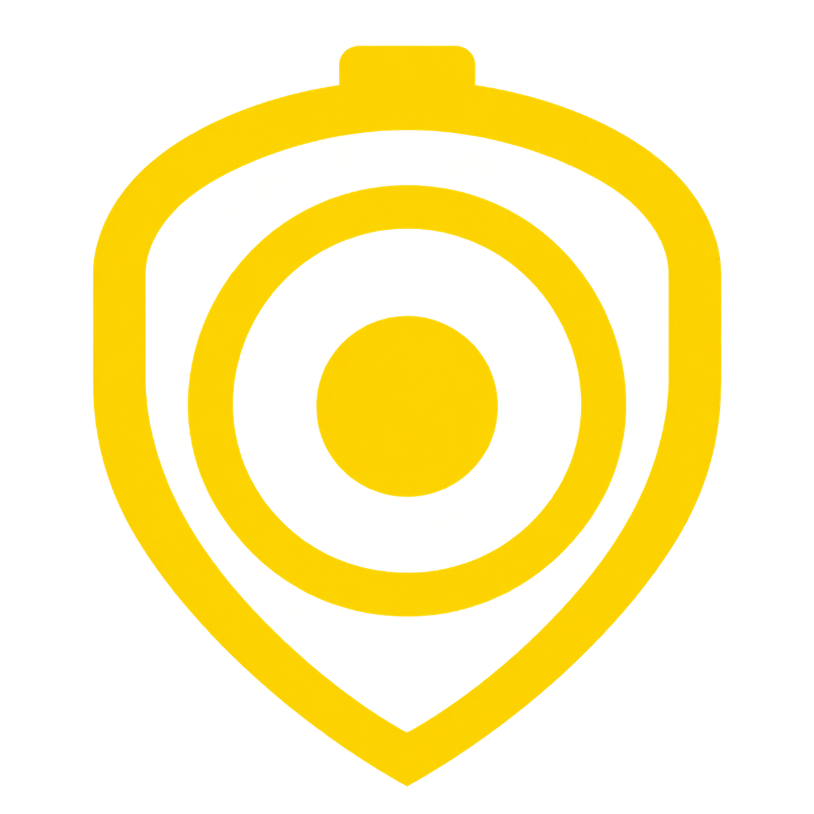
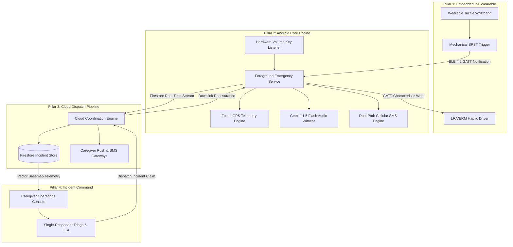

<div align="center">
  
  
  # KAAVAL (കാവൽ)
  
  ### Accessibility-First Emergency Response Ecosystem for Visually Impaired Individuals
</div>


[-3DDC84?style=for-the-badge&logo=android&logoColor=white)](android/)
[](android/)
[](android/)
[](https://kaaval-94c1d.web.app)
[](wearable/KAAVAL_SOS/)
[](https://kaaval-94c1d.web.app/live)
[](https://github.com/KevinGeorge100/KAAVAL/releases/tag/v1.0.0-prod)

Supported by the **IEEE Sensors Council Industry Mentoring Program**.

---

### Quick Access & Distribution Endpoints

| Platform Component | Production Link | Architectural Role |
| :--- | :--- | :--- |
| **Android Client (APK)** | [kaaval-94c1d.web.app/download](https://kaaval-94c1d.web.app/download) | Production Release Build (2.95 MB, R8 Optimized) + Dynamic Phone QR |
| **Incident Command Portal** | [kaaval-94c1d.web.app/live](https://kaaval-94c1d.web.app/live) | Real-time WebGL Vector Operations Dashboard (MapLibre + CARTO Dark) |
| **GitHub Release Registry** | [Releases v1.0.0-prod](https://github.com/KevinGeorge100/KAAVAL/releases/tag/v1.0.0-prod) | Cryptographic release assets, APK checksums, and change logs |
| **Central Engineering Hub** | [docs/README.md](docs/README.md) | Technical architecture, hardware schematics, and testing runbooks |

---

## Executive Overview: Closing the Sensory Gap in Emergency Response

Traditional personal safety solutions are fundamentally flawed: they operate as open-loop, fire-and-forget transmitters. An SMS is sent, but the victim remains stranded in total sensory darkness with zero confirmation that anyone received the alert or is en route.

**KAAVAL establishes a closed-loop emergency response ecosystem** engineered specifically for visually impaired individuals. It bridges instantaneous mechanical activation with real-time situational intelligence and bidirectional tactile reassurance until the individual is safe.

---

## The Sensory Challenge in Emergency Dispatch

Every conventional personal safety solution relies on an untenable assumption: that the victim possesses visual acuity, situational composure, and digital dexterity during an acute crisis.

| Failure Mode in Conventional Systems | KAAVAL Closed-Loop Platform |
| :--- | :--- |
| **Touchscreen Activation Barrier**<br>Requires unlocking a smartphone, locating an emergency dialer, and visually navigating multi-step digital interfaces. | **Sub-120ms Hardware Trigger**<br>Dedicated mechanical switch on BLE wearable wristband + physical hardware volume key interrupt listeners. |
| **The Feedback Vacuum**<br>Unidirectional fire-and-forget SMS dispatches leave the victim in complete darkness with zero feedback on responder status. | **Closed-Loop Tactile Reassurance**<br>Rhythmic haptic heartbeat pulses transmitted to the wristband (`REASSURE`) when a caregiver claims the incident. |
| **Bystander Diffusion & Triage Delay**<br>Broadcasting SMS alerts to multiple family members simultaneously leads to redundant calls, conflicting actions, or inaction. | **Single-Claim Operations Console**<br>Real-time vector dispatch map with atomic concurrency locks, ensuring one primary caregiver claims the rescue with live ETA. |

---

## Technical Architecture: 4-Pillar Synchronization

KAAVAL operates as an event-driven distributed system synchronized across four core subsystems:



### Pillar 1: Embedded IoT Wearable (ESP32)
* **Zero-Latency Physical Activation**: Custom mechanical switch wired to a hardware interrupt delivers sub-120ms transmission over Bluetooth Low Energy.
* **Closed-Loop Tactile Reassurance**: Incorporates an LRA/ERM vibration motor running custom haptic waveforms. When a caregiver claims an incident on the operations console, the wristband executes a rhythmic tactile pulse sequence (`REASSURE`), confirming rescue without audio cues.
* **Non-Blocking State Machine**: Built with asynchronous non-blocking timers, ensuring that BLE advertising and connection supervision intervals remain uninterrupted during vibration bursts.

### Pillar 2: Android Core Emergency Client (Kotlin & Jetpack Compose)
* **Independent Operation**: Operates fully autonomously without the wearable via a low-level physical Volume Key listener (triple-press detection) and TalkBack-certified accessibility semantics.
* **Foreground Lifecycle Resilience**: Bound to a `START_STICKY` Foreground Service with wakelock acquisition, persisting across process termination, deep-sleep battery optimizations, and system reboots.
* **Multi-Tiered Fused Location Engine**: Prioritizes fresh GPS fixes, falling back deterministically to Google Play Services cached locations and direct hardware NMEA providers.
* **Gemini 1.5 Flash Audio Witness**: Automatically records a 10-second high-fidelity ambient acoustic window upon activation, classifies environmental threats (impacts, distress calls, vehicular noise, ambient struggle), and presents structured intelligence to caregivers.
* **Blackout Stealth Mode**: Renders a zero-luminance pitch-black display to prevent hostile detection. De-escalation requires a tactile gesture ("V" shape stroke) verified by an internal geometric engine.

### Pillar 3: Cloud Coordination & Dispatch Pipeline (Firebase)
* **Zero-Trust Client Access**: No administrative keys bundled in client code. Uses restricted client tokens and Firebase App Check.
* **Transient Session Architecture**: Telemetry links automatically expire after 4 hours. All ephemeral coordinate records are scrubbed upon incident closure.
* **Atomic Concurrency Lock**: Eliminates bystander paralysis by enforcing a single-caregiver claim state machine on the incident document.

### Pillar 4: Incident Operations Command (WebGL Vector Web Portal)
* **Hardware-Accelerated Vector Basemaps**: Rendered using MapLibre GL with licensed CARTO Dark Matter vector tiles, providing continuous 60fps zooming, zero raster pixelation, and crisp typography.
* **Tactical Radar Telemetry**: Multi-stage crimson user beacon (`#EF4444`) with dual expanding radar rings, paired with an emerald caregiver navigation beacon (`#10B981`).
* **Live Proximity & Dynamic Routing**: Haversine distance calculations and moving animated trajectory lines towards the incident coordinate centroid.
* **Remote Reassurance Transmitter**: Allows caregivers to trigger downstream tactile reassurance pulses to the wristband with a single click.

---

## Architectural Comparison: Emergency Systems

| Architectural Dimension | Consumer Safety Apps | Legacy Telecare Pendants | KAAVAL Distributed Platform |
| :--- | :--- | :--- | :--- |
| **Activation Channel** | Touchscreen interaction | Stationary RF base station | **Hardware BLE Wearable + Physical Key Listener** |
| **Feedback Loop** | Unidirectional broadcast | Analog voice speakerphone | **Closed-Loop Bidirectional Tactile Pulses (`REASSURE`)** |
| **Situational Intelligence** | Unstructured text | Human operator audio | **Gemini 1.5 Flash Acoustic Scene Classification** |
| **Incident Coordination** | Generic group SMS | Proprietary call center | **WebGL Vector Command Map with Single-Claim Protocol** |
| **Network Resilience** | Data connection required | PSTN landline required | **Dual-Path Redundancy: Firestore over IP + GSM SMS** |
| **Discretion & Anti-Coercion** | Visible, audible alarms | Auditory siren/beeping | **Blackout Stealth Mode with Geometric Gesture Validation** |
| **Accessibility Standard** | Partial touch compliance | Physical hardware only | **W3C WCAG 2.1 Level AAA (~19.5:1 Contrast Ratio)** |

---

## Brand Identity & Design System

The official KAAVAL brand identity embodies defensive vigilance, rapid tactile response, and uncompromising accessibility. Designed specifically for low-vision individuals and high-stress emergency environments, the visual system adheres to strict high-contrast standards.

<div align="center">
  
</div>

### Official Color Palette

| Swatch | Color Name | Hex Code | Role in Ecosystem | Accessibility Standard |
| :---: | :--- | :--- | :--- | :--- |
| 🟨 | **Tactical Yellow** | `#FFD600` | Primary brand identity, SOS triggers, tactile focus rings | **~19.5:1** contrast on Pure Black (Exceeds WCAG AAA) |
| ⬛ | **Pure Canvas Black** | `#000000` | AMOLED backdrop, blackout anti-coercion UI, battery longevity | Baseline canvas (0 cd/m² on OLED panels) |
| ⬜ | **Signal White** | `#FFFFFF` | Primary typography, critical readability, tactile icons | **21:1** contrast on Pure Black (WCAG AAA maximum) |

### Brandmark Architecture
1. **Concentric Eye of Awareness**: Omnidirectional situational perception, audio witness classification, and continuous sensor fusion.
2. **Protective Shield Profile**: Defensive perimeter symbolizing physical and cryptographic safety.
3. **Wearable Beacon Loop**: Mechanical wristband connection establishing a closed-loop link between victim and caregiver.
4. **Zero-Glare Silhouette**: High-contrast contour engineered for instantaneous cognitive recognition under severe stress or low visual acuity.

---

## Hardware Specifications & Wearable BOM

The KAAVAL Wearable prototype is optimized for low power, deterministic latency, and tactile clarity:

| Subsystem | Component Specification | Engineering Role |
| :--- | :--- | :--- |
| **Processing Core** | ESP32-WROOM-32 (Dual-Core Xtensa LX6 @ 240MHz) | BLE 4.2 GATT Server, Interrupt Handling, Haptic Driver |
| **Tactile Trigger** | Momentary SPST Sealed Pushbutton | Low-travel, high-tactile mechanical interrupt |
| **Haptic Actuator** | Precision 1027 Coin ERM / LRA Actuator | Directional tactile confirmation & reassurance pulses |
| **Driver Circuit** | NPN 2N2222 with 1N4001 Flyback Protection | High-transient current isolation and back-EMF clamping |
| **Radio Link** | 2.4GHz BLE 4.2 (GATT Service `4fafc201...`) | Low-power telemetry and downstream control channel |
| **Power Management** | 3.7V 500mAh LiPo with Integrated TP4056 USB-C | Low-dropout regulation with deep-sleep current < 15µA |

---

## Repository Structure

```
KAAVAL/
├── android/                   # Native Android Core Engine
│   ├── app/src/main/java/     # Clean Architecture (MVVM, Hilt, Jetpack Compose)
│   │   ├── accessibility/     # High-contrast M3 theme, TalkBack semantics, Haptic waveforms
│   │   ├── ble/               # KaavalBleManager (GATT client, reconnect loop)
│   │   ├── data/              # Room Database, EmergencySession entity, Firestore repository
│   │   ├── service/           # EmergencyForegroundService (Sticky background lifecycle)
│   │   └── ui/                # Blackout Stealth UI, Emergency Countdown, Caregiver Setup
│   └── build.gradle.kts       # Android Gradle configuration (R8 ProGuard enabled)
│
├── wearable/                  # Embedded IoT Wearable
│   └── KAAVAL_SOS/            # ESP32 Wearable Firmware
│       ├── KAAVAL_SOS.ino     # Non-blocking haptic state machine & BLE GATT server
│       └── compile_flags.txt  # Toolchain compilation flags
│
├── tracking-web/              # Caregiver Operations & Public Distribution
│   ├── live.html              # Tactical WebGL Vector Map (MapLibre + CARTO Dark Matter)
│   ├── download.html          # Public Android App Download & Dynamic QR Portal
│   └── firebase-config.js     # Secure zero-exposure fallback credentials
│
├── functions/                 # Cloud Coordination Functions (Node.js)
│   └── index.js               # SMS gateways, incident auto-expiration, and dispatch webhooks
│
├── docs/                      # Centralized Engineering Documentation
│   ├── architecture/          # System architecture, BLE specifications, and design tokens
│   ├── engineering/           # Sprint logs, adversarial test matrices, and voice/haptic guides
│   └── runbooks/              # Production launch, flashing, and verification procedures
│
└── firebase.json              # Firebase Hosting clean URLs, headers, and security rules
```

---

## Engineering Quickstart

### Prerequisites
- **Android Studio Jellyfish or later** (JDK 17)
- **Arduino IDE / ESP32 Board Core** (for wearable firmware)
- **Node.js 18+** & `firebase-tools` (`npm install -g firebase-tools`)

### 1. Build Android Production Binary
```bash
cd android
./gradlew testDebugUnitTest       # Execute unit test suite
./gradlew assembleRelease         # Compile R8-minified production APK (2.95 MB)
```

### 2. Flash Embedded Wearable Firmware
```bash
# Open wearable/KAAVAL_SOS/KAAVAL_SOS.ino in Arduino IDE
# Select Board: "ESP32 Dev Module"
# Flash via USB-C and verify serial output at 115200 baud
```

### 3. Local Web Simulation & Testing
```bash
cd tracking-web
python -m http.server 8080
# Access portal at http://localhost:8080/live.html?id=KVL-DEMO-TEST
```

### 4. Production Deployment
```bash
firebase deploy --only hosting,firestore:rules
```

---

## Security, Privacy & Ethics

* **Zero Persistent Geolocation History**: Coordinate records are deleted upon incident resolution and auto-expire after 4 hours.
* **Anti-Coercion Protocol**: Blackout UI prevents hostile actors from verifying active distress calls.
* **Cryptographic Data Minimization**: Ephemeral tracking sessions contain only precision metadata, battery telemetry, and audio scene classification labels.

---

## Program Credits & Acknowledgments

* **Kevin George** — *System Architecture, Mobile & AI Engineering*
* **Navami, Adwaid, Jewel** — *Hardware & Electrical Engineering (EEE)*
* **Hemang Mohan** — *Industry Project Mentor*

Developed with support from the **IEEE Sensors Council Industry Mentoring Program**.

---

<p align="center">
  <b>KAAVAL Ecosystem &copy; 2026</b><br>
  <i>Mission-critical emergency response infrastructure.</i>
</p>
