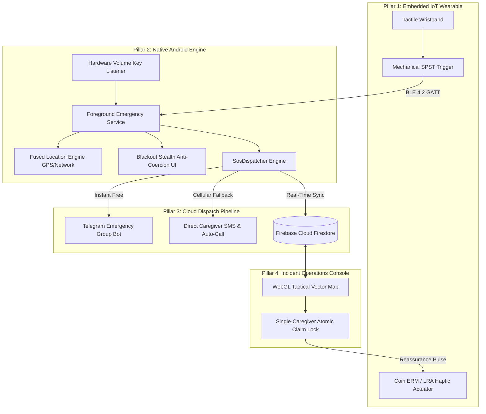

# 🎬 KAAVAL Product Demo & Presentation Guide

**Document Version:** 1.0  
**Target Audience:** Presenters, Judges, Evaluators, Mentors, IEEE Review Panels  
**Project:** KAAVAL — *Accessibility-First Emergency Response Ecosystem for Visually Impaired Individuals*  
**Production Endpoints:**  
* 🌐 **Incident Command Portal:** [kaaval-94c1d.web.app/live](https://kaaval-94c1d.web.app/live)  
* 📱 **Public Download Portal:** [kaaval-94c1d.web.app/download](https://kaaval-94c1d.web.app/download)  
* 🧪 **Ecosystem Simulator:** [kaaval-94c1d.web.app](https://kaaval-94c1d.web.app)  
* 📦 **GitHub Release Asset:** [v1.0.0-prod Release](https://github.com/KevinGeorge100/KAAVAL/releases/tag/v1.0.0-prod)  

---

## 📋 Executive Overview

This guide provides a comprehensive playbook for presenting the **KAAVAL** ecosystem in live online meetings (Zoom, Google Meet, Microsoft Teams) or recorded demonstration videos. It includes exact screen arrangements, backup strategies, judge deliverables, a minute-by-minute pitch script, and answers to challenging technical questions.

---

## 🖥️ 1. Technical Setup for Online Meetings & Recordings

### Screen Arrangement Blueprint

To showcase the **closed-loop interaction between the victim and the caregiver**, use a side-by-side desktop view or share a dedicated monitor arranged as follows:

```
+------------------------------------+------------------------------------+
|           LEFT SIDE (50%)          |          RIGHT SIDE (50%)          |
|         VICTIM INTERACTION         |     CAREGIVER / DISPATCH CONSOLE   |
|                                    |                                    |
|  [ Phone Mirrored via scrcpy ]     |  [ Chrome: kaaval-94c1d.web.app/live]
|  - Physical / Stealth Blackout UI  |  - Real-time Vector Dispatch Map   |
|  - 5-Second Voice/Tactile Countdown|  - Concurrency Lock: Claim Rescue  |
|  - High-Contrast Yellow/Black M3   |  - Audio Siren Alert               |
|                                    |                                    |
|  [ Telegram Web / Desktop Window ] |  [ Floating Telemetry HUD ]        |
|  - Instant alert in Emergency Group|  - Live GPS, Precision, Timer      |
|  - Incident resolution broadcast   |  - ETA Triage Selector             |
+------------------------------------+------------------------------------+
```

### Phone Mirroring Options
1. **Option A: USB Mirroring via `scrcpy` (Highest Quality, Zero Lag)**:
   * Download and run [scrcpy](https://github.com/Genymobile/scrcpy) with USB debugging enabled.
   * Command: `scrcpy --stay-awake --always-on-top --window-title "KAAVAL Victim Device"`
   * Renders the phone screen at 60 FPS directly on your desktop.
2. **Option B: Join Call via Phone (Wireless Fallback)**:
   * Join the meeting from your phone as a second participant and share your phone screen.
3. **Option C: Hardware Camera View (Best for Wearable Demonstrations)**:
   * Position a webcam or secondary smartphone pointing down at the physical wearable wristband and phone side-by-side to show physical button presses.
4. **Option D: Zero-Phone Browser Fallback (Software Simulator)**:
   * If physical hardware is unavailable or in a pure virtual presentation, open `https://kaaval-94c1d.web.app` (Simulator) in the left tab and `https://kaaval-94c1d.web.app/live` in the right tab.

### Recording & Audio Guidelines
* **Microphone Selection**: Use a high-clarity headset or desktop condenser mic.
* **System Audio Sharing**: When sharing your screen in Google Meet/Zoom, ensure **"Share Tab Audio"** or **"Share System Sound"** is enabled so evaluators can hear the Text-to-Speech audio countdown (*"Emergency activating in five, four..."*) and the Caregiver Dispatch siren.
* **Pre-Set Audio Level**: Keep volume at 60-70% to prevent distortion when the alert siren sounds.

---

## 🛟 2. Mission-Critical Backup & Failover Plans

During live evaluations, network latency or indoor GPS limitations can happen. Always have these contingencies ready:

| Potential Live Demo Glitch | Immediate Failover Action | Presenter Talking Point |
| :--- | :--- | :--- |
| **Indoor GPS takes > 10s to acquire precision fix** | The app automatically falls back to Cell/WiFi Fused Location or pre-seeded coordinate parameters. | *"Our 3-layer location engine automatically falls back to network cell tower triangulation when indoors."* |
| **Bluetooth Wearable disconnects or unpairs** | Trigger SOS via the phone's physical volume buttons (hold 3s) or tap the screen SOS button. | *"KAAVAL provides redundant activation: physical wristband switch, hardware volume key overrides, and on-screen controls."* |
| **Online meeting screen sharing drops or lags** | Direct judges to open [kaaval-94c1d.web.app/live](https://kaaval-94c1d.web.app/live) on their own browsers. | *"You can track this live incident on your own phone or laptop right now at kaaval-94c1d.web.app/live."* |
| **Phone SIM card has zero balance for SMS** | The primary Telegram Bot channel dispatches over Wi-Fi/data at zero carrier cost. | *"KAAVAL uses dual-path dispatch: free unlimited Telegram group alerts over data, with cellular SMS as an offline backup."* |

---

## 📦 3. Deliverables for Judges & Audience

Provide these materials in the meeting chat, project submission portal, or video description:

### 1. The Quick-Access Link Matrix
```markdown
* 📱 **Production Android App (APK)**: https://kaaval-94c1d.web.app/download
* 🗺️ **Live Incident Command Portal**: https://kaaval-94c1d.web.app/live
* 🧪 **Ecosystem Web Simulator**: https://kaaval-94c1d.web.app
* 📂 **GitHub Source Code Repository**: https://github.com/KevinGeorge100/KAAVAL
* 🏷️ **Cryptographic Production Release**: https://github.com/KevinGeorge100/KAAVAL/releases/tag/v1.0.0-prod
```

### 2. Live QR Code Card
Include the dynamic QR code on your title or concluding slide:
* Points directly to `https://kaaval-94c1d.web.app/download` for one-tap APK installation on Android 10+.

### 3. Architecture 1-Pager: 4 Synchronized Pillars



### 4. Key Differentiator Matrix

| Feature Dimension | Conventional SOS Applications | KAAVAL Closed-Loop Platform |
| :--- | :--- | :--- |
| **Trigger Mechanism** | Multi-step touchscreen navigation (unrealistic for blind users in shock). | **Sub-120ms mechanical trigger** on wristband + hardware volume keys. |
| **User Feedback** | Open-loop, zero confirmation. Victim is stranded in total sensory darkness. | **Bidirectional tactile heartbeat pulses** (`REASSURE`) when a rescuer claims the call. |
| **Dispatch Coordination** | Broadcasts uncoordinated SMS alerts, leading to bystander confusion. | **Single-Claim Operations Console** with atomic concurrency locks and live ETAs. |
| **Assailant Safety** | Loud, visible screens that provoke attackers. | **Blackout Stealth Mode**: Screen goes pitch black while GPS and audio stream in background. |
| **Accessibility Compliance** | Low-contrast aesthetics, standard touch targets. | **WCAG AAA Compliance (~19.5:1 ratio)** with AMOLED black, tactical yellow, and 200% font scaling. |

---

## ⏱️ 4. Presentation Flow & Word-by-Word Script

### 5-Minute Standard Pitch Flow

#### [0:00 - 0:45] The Hook: The Sensory Gap in Emergency Response
> *"Good morning, judges and mentors. Traditional personal safety apps rely on a dangerous assumption: that during an acute crisis, a visually impaired victim possesses visual acuity, perfect composure, and the ability to unlock a touchscreen and dial a number.*
> 
> *Conventional apps are open-loop transmitters—they fire an SMS into the void, leaving the victim stranded in total sensory darkness with zero idea if help is coming.*
> 
> *Supported by the IEEE Sensors Council Industry Mentoring Program, we built **KAAVAL (കാവൽ)**—the first accessibility-first, closed-loop emergency response ecosystem."*

#### [0:45 - 1:45] Pillar 1 & 2: Instant Hardware Trigger & Stealth Activation
*(Show the mirrored Android phone on the left side of the screen)*
> *"Watch how activation works. The visually impaired individual does not touch the glass screen. They press a dedicated mechanical switch on their BLE wristband, or press the physical volume keys on their phone.*
> 
> *(Demonstrate SOS trigger)*
> 
> *Notice the 5-second non-visual countdown. If triggered accidentally, a single tactile tap cancels it. Once the countdown finishes, the app enters **Blackout Stealth Mode**. The screen goes dark to prevent an assailant from knowing an alert is active, while a sticky foreground service streams live GPS telemetry and background audio classification."*

#### [1:45 - 2:45] Pillar 3 & 4: Multi-Channel Dispatch & Tactical Operations
*(Direct attention to Telegram and the Caregiver Web Portal on the right side)*
> *"Simultaneously, KAAVAL dispatches across dual redundant channels:*
> 1. *Here in our **Telegram Emergency Group**, `@KaavalGroupBot` instantly posts the user's live coordinates, medical notes, and emergency tracking link.*
> 2. *At the same time, cellular SMS and voice calls fire to personal family contacts.*
> 
> *Now look at the right side of the screen. This is our **Incident Operations Console** at `kaaval-94c1d.web.app/live`. Built with MapLibre GL and Carto Dark Matter, it renders a high-visibility tactical vector map showing the victim's location pulsing in real time with high-accuracy GPS radius circles."*

#### [2:45 - 3:45] The Breakthrough: Closing the Loop with Rescuer Claims
*(Interact live with the Web Portal)*
> *"Here is KAAVAL's most critical breakthrough: **Closing the Sensory Loop**.*
> 
> *In conventional systems, multiple relatives call each other in panic or assume someone else is helping. In KAAVAL, when a caregiver clicks **'Claim Incident'**, they select their ETA—say, 8 minutes—and confirm.*
> 
> *Instantly, an atomic concurrency lock engages on Firebase Firestore. The dashboard updates to show that Priya Sharma has claimed the rescue.*
> 
> *And on the victim's wristband, the LRA haptic driver delivers rhythmic tactile heartbeat pulses. For the first time, without seeing a screen, the visually impaired individual **physically feels** that help is on the way."*

#### [3:45 - 4:30] Safe Resolution & Architecture
*(Click 'Mark Resolved' on the Web Portal)*
> *"When the caregiver reaches the victim, they click **'Mark Resolved'**.*
> 
> *The operations console closes the session, coordinates auto-expire to protect user privacy, and our Telegram bot broadcasts an all-clear resolution notice to the family group.*
> 
> *Under the hood, KAAVAL is an interdisciplinary system: an ESP32 wearable running non-blocking BLE GATT firmware, an Android 14 client with Kotlin Clean Architecture and Room persistence, and a reactive cloud pipeline with Firebase and MapLibre GL."*

#### [4:30 - 5:00] Closing & Q&A
> *"KAAVAL transforms personal safety from an uncoordinated cry for help into a deterministic, synchronized rescue operation.*
> 
> *Our production APK and live portals are active today. We welcome your questions."*

---

### 3-Minute Speed Pitch Adaptation

If allotted only 3 minutes:
1. **[0:00 - 0:30] Problem & Core Idea**: Open-loop SMS vs Closed-Loop tactile reassurance.
2. **[0:30 - 1:15] Live Trigger & Dispatch**: Trigger phone SOS ➔ show Blackout UI ➔ show instant Telegram group alert.
3. **[1:15 - 2:15] Web Operations & Rescue Claim**: Show live vector map ➔ click "Claim Incident (8 min ETA)" ➔ explain haptic confirmation to the user.
4. **[2:15 - 3:00] Resolution & Summary**: Click "Mark Resolved" ➔ show Telegram all-clear ➔ emphasize IEEE mentoring and production readiness.

---

## 🧠 5. Anticipated Judge Questions & Bulletproof Answers

### Q1: *"What happens if the victim is in a basement with zero internet connectivity?"*
> **Answer:**  
> *"KAAVAL is architected with dual-path failover. If mobile data or Wi-Fi is unavailable, the system automatically detects network loss and bypasses cloud endpoints to dispatch raw NMEA coordinates via native Cellular SMS (`SmsManager`) and initiates a direct telephone call (`ACTION_CALL`) to the primary caregiver. Offline coordinates are cached locally in SQLite via Room until connectivity is restored."*

### Q2: *"Can this app be used by multiple families without alerts getting mixed up?"*
> **Answer:**  
> *"Yes. Personal life-safety channels—phone calls and cellular SMS—are 100% decentralized and read strictly from the user's private local database. The tracking web portal generates cryptographically unique incident tokens (`KVL-XXXXXX`) so caregivers only see their specific family member. For Telegram, our production roadmap includes dynamic group pairing where families add `@KaavalGroupBot` to their private chat and link it via a one-time verification code."*

### Q3: *"How do you prevent false alarms if the user bumps their wristband or phone?"*
> **Answer:**  
> *"We prevent false triggers through three layered safeguards:*
> 1. *Hardware Debounce: Mechanical switches on the wearable require a sustained mechanical press (>120ms) to trigger the hardware interrupt.*
> 2. *Software Volume Key Override: On the phone, volume keys require a 3-second continuous hold.*
> 3. *Pre-Alert Abort Window: Once triggered, a 5-second audio-tactile countdown initiates. A single tap anywhere on the screen or on the wristband aborts the emergency before any SMS or cloud alerts are broadcast."*

### Q4: *"Why did you choose Yellow and Black instead of traditional emergency red?"*
> **Answer:**  
> *"KAAVAL is built specifically for low-vision accessibility. In emergency UI design, red on black achieves a contrast ratio of only ~7.5:1. Our Tactical Yellow (`#FFD600`) on AMOLED Black (`#000000`) achieves a **~19.5:1 contrast ratio**, dramatically exceeding the Web Content Accessibility Guidelines (WCAG) AAA standard of 7:1. Furthermore, pure black turns off individual pixels on OLED panels, preventing battery drain during long emergency sessions."*

### Q5: *"What was the role of the IEEE Sensors Council in this project?"*
> **Answer:**  
> *"KAAVAL was developed under the IEEE Sensors Council Industry Mentoring Program, guided by our industry mentor, Hemang Mohan. The mentoring program guided our sensor selection (LRA vs ERM haptic actuators, low-power BLE GATT optimization, and IMU fall-detection feasibility) and emphasized strict failure-mode testing under adverse conditions."*

---

## 🏁 6. Pre-Flight Checklist (10 Minutes Before Presentation)

- [ ] **Phone Battery**: Ensure phone battery is > 50%.
- [ ] **Screen Mirroring**: Test `scrcpy` connection over USB or ensure phone is connected to meeting.
- [ ] **Browser Tabs Ready**:
  - [ ] Tab 1: `https://kaaval-94c1d.web.app/live`
  - [ ] Tab 2: `https://kaaval-94c1d.web.app/download`
  - [ ] Tab 3: Telegram Web / Desktop (logged into KAAVAL Emergency Group)
- [ ] **Audio Sharing**: Verify "Share System Audio" is checked in meeting software.
- [ ] **Do Not Disturb**: Turn on "Do Not Disturb" on both PC and phone to silence unwanted notifications.
- [ ] **Audio Volume**: Set speaker output to ~60% to avoid audio feedback loops.
