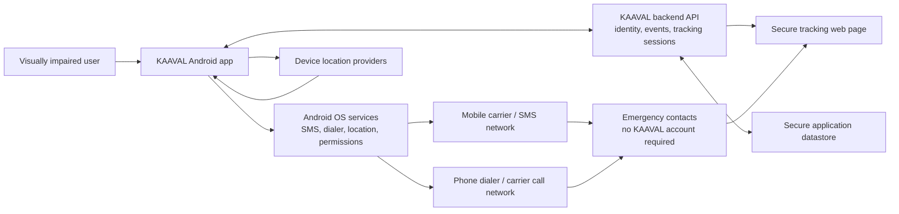
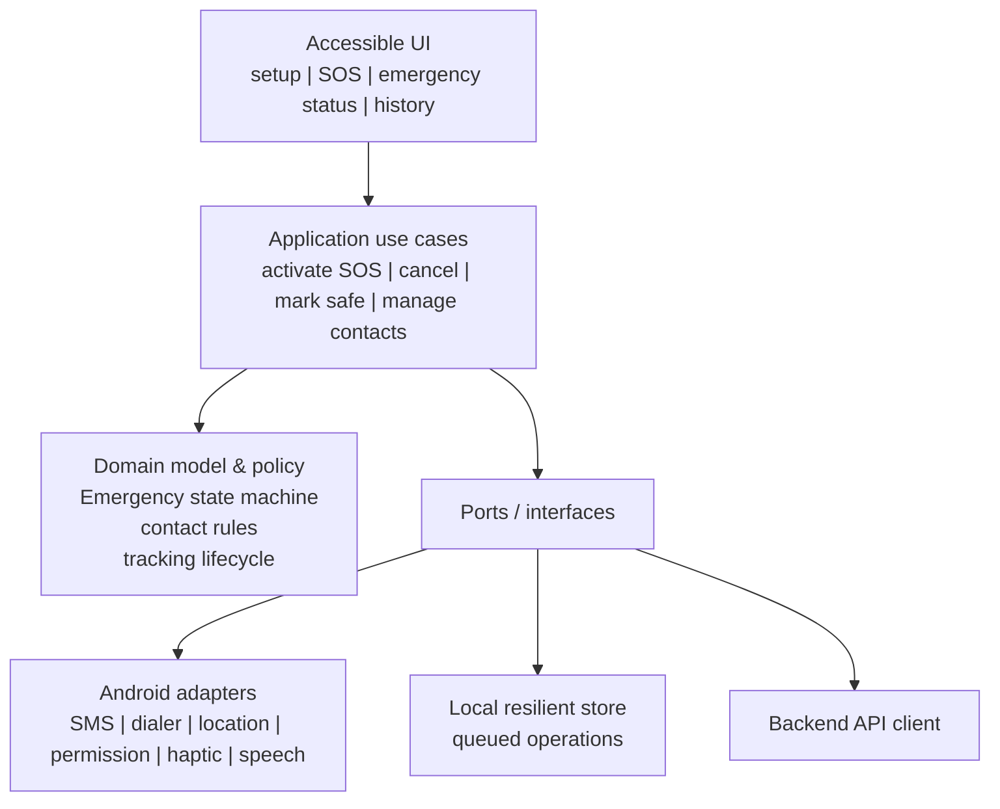

# KAAVAL MVP Architecture v1.0

**Status:** Proposed high-level architecture — pending approval  
**Scope source:** KAAVAL MVP Scope v1.0  
**Architecture style:** Android mobile client with a small, security-focused backend and public, time-limited tracking pages  
**Technology status:** Technology-neutral. No framework, cloud vendor, database, map provider, SMS provider, or authentication provider is selected by this document.

## 1. Architecture Goal

Support the approved Android MVP emergency flow reliably and accessibly:

1. User holds the SOS control for three seconds.
2. A five-second cancellation countdown is presented with accessible feedback.
3. If not cancelled, an emergency is activated without waiting for GPS.
4. SMS is initiated to all saved emergency contacts.
5. A call is initiated to the Primary Emergency Contact.
6. A secure live-location session begins when location is available.
7. Tracking ends when the user marks themselves safe or after 60 minutes.
8. The event is retained in emergency history.

The architecture prioritizes three properties:

- **Availability:** alerting must not wait for a location fix or a backend round-trip.
- **Privacy:** location is shared only through a time-limited, access-controlled emergency session.
- **Traceability:** the app records what it attempted and the backend records the event lifecycle without claiming delivery or response assurance it cannot prove.

## 2. Overall System Architecture



### Trust boundaries

- The Android application is trusted only for the authenticated user’s actions; it must not be trusted to authorize arbitrary access to backend data.
- The backend is the authority for accounts, emergency-event ownership, tracking-session expiry, and access-token validation.
- Contacts are unauthenticated recipients. Possession of a live-tracking link is not sufficient by itself to grant unlimited or permanent access.
- Android OS, the mobile carrier, GPS/location providers, and the recipient’s device are external dependencies and cannot be guaranteed by KAAVAL.

## 3. Major Software Components

| Component | Responsibility | Scope boundary |
|---|---|---|
| Android presentation layer | Accessible setup, SOS, countdown, emergency status, mark-safe, and history screens | No business-policy duplication beyond presentation safety checks |
| Emergency orchestration module | Executes the local emergency state machine and coordinates SMS, call, location, persistence, and backend synchronization | Does not promise SMS delivery or call connection |
| Contact and profile module | Stores and validates user profile, contacts, and the Primary Emergency Contact selection | Does not create caregiver accounts |
| Location-tracking module | Gets the best available location, manages the 60-minute tracking lifecycle, and uploads updates when possible | Does not delay alert initiation |
| Device integration adapters | Isolate Android SMS, dialer, permissions, location, background execution, secure local storage, and accessibility feedback | Vendor / OS APIs remain replaceable |
| Local resilient store | Persists emergency state and queued work across app/process interruption | Not the system of record for account data |
| Backend API | Authenticated user data, event lifecycle, tracking-session issue/expiry, location ingestion, event history sync | Does not make decisions for the user |
| Tracking-page service | Serves the recipient-facing, minimal live-location page | No caregiver dashboard or coordination features |
| Application datastore | Stores user, contacts, events, tracking sessions, location updates, audit records | Must enforce ownership and expiry |
| Observability service | Privacy-preserving crash, performance, and operational telemetry | Must never include precise location, phone numbers, or SMS body by default |

## 4. Mobile Application Architecture

Use a layered, feature-oriented architecture so that UI, emergency rules, and Android integration can evolve independently.



### Emergency state machine

```mermaid
stateDiagram-v2
    [*] --> Ready
    Ready --> HoldInProgress: SOS press
    HoldInProgress --> Ready: released before 3 seconds
    HoldInProgress --> Countdown: held for 3 seconds
    Countdown --> Ready: user cancels within 5 seconds
    Countdown --> Activating: countdown completes
    Activating --> Active: alert/call initiation begins; tracking session created or queued
    Active --> Safe: user marks safe
    Active --> Expired: 60 minutes elapsed
    Safe --> Closed
    Expired --> Closed
    Closed --> [*]
```



`Activating` must create a durable local record before side effects are attempted. This prevents a process restart from silently losing the event and allows safe retries of backend synchronization. Each external request uses an idempotency key so retries do not create duplicate server events or duplicate location records.

### Accessibility architecture

- Accessibility labels, focus order, spoken status, haptics, text sizing, contrast, and localization are part of the presentation component’s definition of done.
- The emergency state machine emits semantic status events (for example, `countdown_started`, `alert_initiated`, `location_unavailable`, `tracking_active`, `tracking_ended`) rather than UI-specific messages. This lets visual, TalkBack, voice, and haptic feedback remain consistent.
- All essential emergency actions must remain possible with screen-reader navigation and without reliance on color, precise gestures, or time-sensitive visual cues alone.

## 5. Backend Architecture

The backend is deliberately narrow. It supports the MVP’s authenticated data, event history, secure tracking links, and location synchronization; it does not implement caregiver coordination.

```mermaid
flowchart TB
    APP["Android app"] --> API["Authenticated API / service boundary"]
    API --> ID["Identity integration"]
    API --> EVENT["Emergency event service"]
    API --> TRACK["Tracking-session service"]
    EVENT --> DB[("Application datastore")]
    TRACK --> DB
    TRACK --> TOKEN["Token issue, validation, expiry"]
    WEB["Tracking web page"] --> TOKEN
    WEB --> TRACK
    OBS["Operational telemetry"] <-- API
```

### Backend responsibilities

- Authorize users to access only their own profile, contacts, events, and tracking sessions.
- Create and close emergency events.
- Create a 60-minute tracking session tied to exactly one emergency event.
- Generate a secure, revocable tracking link/token and validate it for the tracking page.
- Accept location updates only for the authenticated owner’s active tracking session.
- Return the last accepted location to an authorized tracking-link holder only while the session is active.
- Apply server-side expiry even if the mobile app stops unexpectedly.
- Preserve an event history record and a minimal audit trail.

### Backend non-responsibilities

- It does not assert that an SMS was delivered, read, or acted upon.
- It does not assert that the primary contact answered the call.
- It does not assign responders, send push notifications, provide ETA, or coordinate caregivers.
- It does not need a general public API; all public recipient access is limited to the tracking page and scoped token.

## 6. External Services and Platform Dependencies

| Dependency | Purpose | Architecture position |
|---|---|---|
| Android location services | Obtain location updates | Device-side adapter |
| Android SMS capability / carrier SMS | Initiate emergency SMS messages | Device-side primary path under the MVP’s availability requirement |
| Android dialer / carrier call network | Initiate the primary-contact call | Device-side adapter |
| Authentication provider | Create and verify a user session | Backend identity boundary |
| Hosting and datastore provider | Run backend and persist data | Backend implementation choice |
| Mapping/geocoding provider | Render location on the recipient tracking page, if selected | Optional presentation dependency; coordinates/link remain the core data |
| Monitoring provider | Detect failures and service health | Privacy-preserving observability boundary |

No vendor in this table is selected by this architecture.

## 7. Emergency Data Flow

```mermaid
sequenceDiagram
    actor User
    participant App as KAAVAL Android app
    participant OS as Android/Carrier services
    participant API as KAAVAL backend
    participant Contact as Emergency contacts
    participant Page as Secure tracking page

    User->>App: Hold SOS for 3 seconds
    App->>User: Accessible 5-second countdown
    User-->>App: Cancel (optional)
    App->>App: Create durable local emergency record
    App->>App: Start location acquisition (non-blocking)
    App->>OS: Initiate SMS to all contacts
    OS-->>Contact: SMS, with tracking link when available
    App->>OS: Initiate call to Primary Emergency Contact
    App->>API: Create/sync event and tracking session
    API-->>App: Secure, expiring tracking link
    App->>API: Upload location when available
    Contact->>Page: Open tracking link
    Page->>API: Validate scoped token; read active location
    API-->>Page: Latest authorized location
    User->>App: Mark safe (or 60 minutes elapse)
    App->>API: Close session; stop tracking
    API-->>Page: Link is expired / no active tracking
```

### Required failure path: no immediate location

1. Start obtaining location.
2. Do **not** wait for a location fix.
3. Initiate SMS to every contact, indicating that location is currently unavailable when that is true.
4. Initiate the primary-contact call.
5. Keep acquiring location and create/update the tracking session when connectivity permits.

### Important unresolved feasibility boundary

The approved MVP requires every emergency SMS to include a secure live-tracking link, while also requiring alerts not to wait for connectivity or location. A link that is backed by the cloud cannot be created when the device has no data connection. This architecture does **not** invent a behavior for that case. The PRD must explicitly decide whether the initial SMS may omit the link when offline and whether a later follow-up SMS is permitted once a link becomes available.

## 8. Authentication Architecture

Authentication is not finalized. The selected method must create a stable account identity for secure data ownership; recipients of SMS do **not** need accounts.

| Option | Benefits | Drawbacks | Recommendation |
|---|---|---|---|
| Phone-number OTP | Matches a mobile-first Indian product and reduces setup friction; can aid recovery | OTP cost, SIM/number-change issues, dependency on delivery | **Recommended primary option**, subject to provider, cost, abuse controls, and privacy review |
| Email and password | Widely understood; less dependence on telecom delivery | More typing and password-recovery burden, which is less suitable under accessibility constraints | Suitable fallback or later option |
| Federated sign-in | Fast for users with an existing account; provider handles passwords | Not universal and introduces provider dependency | Optional convenience method, not the sole method |

Regardless of choice:

- Backend authorization must be based on a server-verified user identity, never a device identifier.
- Access tokens must be short-lived and refreshable; sensitive actions must require an authenticated session.
- Contact phone numbers are user data, not login identities.

## 9. Security and Privacy Architecture

### Controls

- Encrypt data in transit using modern TLS.
- Encrypt sensitive data at rest through the selected datastore and securely store local secrets using Android-backed secure storage.
- Enforce server-side ownership checks for every profile, contact, event, and location request.
- Use opaque, high-entropy tracking tokens; keep them time-limited to the active session (maximum 60 minutes), revocable, and non-enumerable.
- Do not put raw latitude/longitude, phone numbers, auth credentials, or private event details into logs, analytics, crash reports, URLs beyond the opaque token, or notification text.
- Request permissions just-in-time with clear, accessible explanations of why SMS/call/location access is necessary.
- Support explicit user consent for contacting saved contacts and sharing location during an emergency.
- Apply data minimization to retained locations and define retention/deletion policies before release.

### Security decisions still required

- Tracking-link access model beyond token possession (for example, whether an additional recipient verification step is required).
- Location-update frequency and location-data retention period.
- Account deletion and emergency-history deletion behavior.
- Whether contact phone numbers are encrypted at the field level in addition to datastore encryption.

## 10. Offline and Degraded-Network Behavior

| Condition | Required behavior | Limit |
|---|---|---|
| GPS unavailable | Send SMS and initiate primary call without delay; continue location acquisition | Recipient cannot be located until a location fix is obtained |
| Internet unavailable | Persist event and location updates locally; retry backend sync using idempotent requests when connectivity returns | Secure cloud tracking link cannot be created or updated while offline; required user-facing behavior is unresolved |
| SMS/carrier unavailable | Record the failed initiation attempt, provide accessible status, and preserve the event | KAAVAL cannot guarantee an alert without carrier service |
| Call cannot start/connect | Provide accessible status and retain the event | No automatic escalation is in MVP scope |
| App process is interrupted | Durable local state restores active-event context and retries pending backend work when allowed | OS battery/process restrictions can still affect continuity |
| Permission denied | Explain the missing capability in accessible language and prevent claiming that the unavailable action succeeded | SMS, call, or tracking capability may be reduced or unavailable |

For Android live tracking, the design must use the platform’s approved foreground/background execution model and prominent user visibility. Current Android rules require a location foreground-service type for location foreground services and tightly restrict background starts and location access; background location is a separate permission decision. [Android foreground-service guidance](https://developer.android.com/develop/background-work/services/fgs/service-types), [background-location guidance](https://developer.android.com/develop/sensors-and-location/location/permissions/background)

## 11. Scalability Considerations

The initial target is hundreds of users, so favor a modular monolith/backend service rather than distributed microservices. The boundaries in this document allow future replacement or separation without prematurely operating many services.

- Use stateless API instances behind a load balancer so they can scale horizontally.
- Store events and location updates separately from user profile data; location updates are the likely high-write workload.
- Expire and archive/aggregate old location updates according to a future retention policy to control cost and privacy exposure.
- Use asynchronous queues for non-critical work such as analytics, cleanup, and notifications in future phases; do not put emergency activation behind a queue.
- Use idempotency keys and request tracing for event creation and location uploads.
- Design tracking URLs and API rate limits to tolerate many recipients refreshing the same active session.
- Keep caregiver coordination behind separate future modules; do not couple the MVP schema to a caregiver-account model.

## 12. Risks and Trade-offs

| Risk / trade-off | Impact | Architecture response |
|---|---|---|
| SMS permission and Play policy | Automatic SMS is core to the MVP but high-risk permission use is policy-controlled | Use only the emergency-alert use case, complete the required Play declaration/review, and retain a policy-compliant fallback decision before launch. Google Play lists physical-safety emergency SMS alerts as a permitted `SEND_SMS` use case, subject to review. [Google Play policy](https://support.google.com/googleplay/android-developer/answer/10208820?hl=en) |
| Automatic call constraints | Fully unattended calls may not be accepted or technically available in all distribution contexts | Isolate call initiation behind an adapter and validate the final UX/policy route early. A dial intent needs no call permission but requires the user to initiate the call; this may not satisfy the approved automatic-call requirement. [Google Play policy alternatives](https://support.google.com/googleplay/android-developer/answer/10208820?hl=en) |
| Offline versus secure link | Immediate alerting conflicts with a cloud-backed tracking link when no data connection exists | Keep SMS/call independent of backend; obtain a product decision for the offline-link case before implementation |
| Background tracking restrictions | Android can stop or restrict background work and location access | Begin tracking from the user-visible emergency flow, use compliant foreground execution, test across Android versions, and communicate tracking status clearly |
| Link forwarding | A recipient can forward a tracking URL | Use opaque, short-lived, revocable tokens and minimize tracking-page data |
| False triggers | Emergency contact fatigue and privacy exposure | Preserve the approved hold-plus-countdown cancellation design; do not add AI detection in MVP |
| No acknowledgement | MVP cannot confirm that help is on the way | State this limitation honestly; solve it with caregiver acknowledgement in Phase 2 |

## 13. Architecture Decision Records

### ADR-001: Mobile-first Android MVP

- **Status:** Accepted by scope.
- **Decision:** Build the MVP as an Android mobile application only.
- **Rationale:** The approved MVP targets India, excludes iOS and wearable hardware, and needs direct integration with Android SMS, dialer, location, accessibility, and background-execution capabilities.
- **Consequence:** iOS and wearable interfaces remain future adapters, not MVP work.

### ADR-002: No caregiver application in MVP

- **Status:** Accepted by scope.
- **Decision:** Emergency contacts do not need KAAVAL accounts or an application; they receive SMS and may open a tracking link.
- **Rationale:** This reduces onboarding friction and avoids months of caregiver-app and coordination work.
- **Consequence:** The MVP cannot deliver responder acknowledgement, assignment, ETA, or coordination.

### ADR-003: Device-side emergency initiation; backend-supported tracking

- **Status:** Proposed; requires approval.
- **Decision:** Start SMS, call initiation, and location acquisition on-device; use the backend for event history and secure live-location sessions.
- **Rationale:** Device-side initiation best supports the requirement not to delay requesting help while waiting for GPS or a backend response. The backend is needed for secure multi-recipient tracking links and expiry.
- **Consequence:** The system must handle eventual synchronization and the offline tracking-link gap.

### ADR-004: Time-limited, tokenized tracking links

- **Status:** Proposed; requires approval.
- **Decision:** Use opaque, high-entropy, server-validated tracking tokens that expire at mark-safe or 60 minutes, whichever occurs first.
- **Rationale:** Recipients have no accounts; an expiring scoped token is the least-friction way to grant temporary access while reducing long-term exposure.
- **Consequence:** Links need a backend and connectivity. Token possession remains a privacy risk if recipients forward the link.

### ADR-005: Durable local emergency state and idempotent backend requests

- **Status:** Proposed; requires approval.
- **Decision:** Persist the emergency lifecycle locally before initiating external actions; use idempotency keys for backend requests.
- **Rationale:** An emergency must survive process interruption and network retries without duplicate server events.
- **Consequence:** Local state requires secure storage and explicit recovery behavior.

### ADR-006: Phone-number OTP as the preferred authentication direction

- **Status:** Recommendation only; not finalized.
- **Decision:** Prefer phone-number OTP as the primary authentication option, subject to later provider, abuse, cost, and privacy evaluation.
- **Rationale:** It aligns with a mobile-first Indian product and avoids password-management burden.
- **Consequence:** The final stack must include OTP rate limits, recovery/number-change handling, and fallback paths.

### ADR-007: Technology provider selection deferred

- **Status:** Accepted.
- **Decision:** Do not select Flutter, Firebase, a database, mapping provider, SMS provider, or authentication provider in this architecture.
- **Rationale:** The project explicitly requires architecture approval before final technology-stack selection.
- **Consequence:** Future technology evaluation must demonstrate support for these architecture boundaries and MVP acceptance criteria.

## 14. Approval Gates Before Technology Selection

Before selecting a final stack or starting implementation, resolve and approve:

1. Offline behavior when a secure tracking link cannot be created at emergency time.
2. The exact Android / Google Play-compliant method for automatic SMS and primary-contact call initiation.
3. Authentication method and recovery model.
4. Tracking-link recipient access model.
5. Location-update frequency, retention period, and account/event deletion policy.
6. The minimum Android version and supported-device policy.
7. The test plan for TalkBack, Malayalam, low connectivity, denied permissions, GPS failure, SMS failure, call failure, and 60-minute tracking expiry.

---

This architecture intentionally covers only the approved MVP. Wearables, caregiver coordination, push notifications, AI, medical profiles, QR profiles, iOS, and escalation are excluded until a later approved scope revision.
