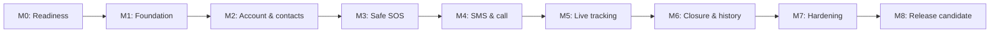

# 🏛️ KAAVAL Software Architecture & Clean Implementation Specification

---
**Document Version:** 1.0  
**Status:** Approved Implementation Architecture Baseline  
**Target Platform:** Native Android (Kotlin Clean Architecture + Jetpack Compose)  
**Package Namespace:** `com.kaaval.app`  
---

## 1. Delivery Principles

- Build the emergency workflow in vertical slices. Every milestone must run on a real Android device and have a clear demo.
- Treat accessibility, privacy, and failure handling as acceptance criteria for each feature, not a final polishing phase.
- Do not begin a feature that depends on an unresolved release gate without documenting a fallback or a deliberate decision.
- Keep the backend small and use managed services; do not introduce microservices, caregiver accounts, wearable code, AI, iOS, or other out-of-scope work.
- Prefer reliable and understandable behavior over clever automation.

## 2. Delivery Roadmap

| Phase | Milestone | Primary outcome | Estimate* |
|---:|---|---|---:|
| 0 | M0 — Product-to-engineering readiness | Approved decisions, accounts, risks, and test devices ready | 2–3 days |
| 1 | M1 — Foundation | Installable Android app with accessibility baseline and CI | 1 week |
| 2 | M2 — Account and emergency-contact setup | Authenticated user can manage contacts and designate one primary contact | 1–1.5 weeks |
| 3 | M3 — Safe SOS activation | Fully accessible hold/countdown/cancel workflow with durable local state | 1–1.5 weeks |
| 4 | M4 — Emergency alert and primary call | Device attempts SMS to all contacts and call initiation to primary contact | 1.5–2 weeks |
| 5 | M5 — Secure live tracking | Active event has a secure, time-limited tracking link and location updates | 2–3 weeks |
| 6 | M6 — Mark-safe, history, and resilience | Events close correctly, appear in history, and recover from interruptions | 1–1.5 weeks |
| 7 | M7 — Hardening and accessibility validation | Tested MVP candidate on real devices and failure conditions | 2 weeks |
| 8 | M8 — Release preparation and demonstration | Internal/release candidate distributed with documentation and monitoring | 1 week |

\*Estimates assume one focused developer with access to physical Android devices. Total: approximately **11–14 weeks**. The SMS/call policy gate and live-tracking offline decision can extend the schedule; they must be resolved early.



## 3. Phase-by-Phase Plan

### Phase 0 — M0: Product-to-Engineering Readiness

**Goal:** Remove blockers before code begins.

**Work**

- Review and version the approved scope, architecture, technology stack, and this plan in the repository.
- Create the Firebase and Google Cloud/Maps projects, billing alerts, least-privilege project roles, and separate development/staging/production environments.
- Confirm the minimum supported Android version and physical device matrix.
- Obtain at least two physical Android devices/SIMs to test SMS and calls, preferably across different Android versions and carriers.
- Decide and document the unresolved offline tracking-link behavior.
- Validate the Google Play permission declaration path for physical-safety emergency SMS.
- Prototype and validate the Android/Play-compliant behavior for primary-contact call initiation.
- Create a privacy/data-retention decision record covering location data, tracking links, history, and deletion.

**Definition of Done**

- Required project accounts exist and access is protected with MFA.
- Development and production credentials are separate and never stored in Git.
- The SMS/call mechanism has a documented feasibility result.
- The offline secure-link behavior is approved.
- The test-device matrix and release-distribution approach are documented.

**Testing**

- Manual platform feasibility tests for SMS, call initiation, runtime permissions, and location foreground-service behavior.
- No feature work is considered complete in this phase.

**Deliverables**

- ADRs for unresolved decisions.
- Environment/secrets checklist.
- Device test matrix.
- Policy validation evidence and prototype findings.

### Phase 1 — M1: Foundation

**Goal:** Establish a buildable, accessible, testable Android project and a minimal backend foundation.

**Feature implementation order**

1. Gradle project, version catalog, Kotlin, Compose, and baseline modules.
2. Navigation shell and theme with English/Malayalam resource structure.
3. Hilt dependency injection, ViewModel/StateFlow conventions, and repository interfaces.
4. Firebase project connection, environment configuration, and App Check plan.
5. CI checks: build, static analysis, unit tests, and artifact upload.
6. Crash reporting and privacy-safe logging scaffold.
7. A non-sensitive app-health screen or placeholder screen to verify installation and navigation.

**Definition of Done**

- The app installs from CI on a physical device.
- CI runs clean builds, tests, and static analysis for every pull request.
- The app has semantic labels, scalable text, and TalkBack-tested navigation for the initial shell.
- Debug and release configuration are separate; no secret is committed.
- Crash reporting is integrated with no PII logging.

**Testing**

- Unit tests for a sample ViewModel and repository fake.
- Compose UI tests for initial navigation and accessibility semantics.
- Manual TalkBack test in English and Malayalam resource fallback check.
- CI build on every pull request.

**Deliverables**

- Working Android skeleton application.
- CI workflow and documented local developer setup.
- Initial architecture decision records and coding-standard enforcement.

### Phase 2 — M2: Account and Emergency-Contact Setup

**Goal:** A user can securely create/access an account, manage contacts, and choose a Primary Emergency Contact.

**Feature implementation order**

1. Firebase Phone Authentication integration and accessible OTP flow.
2. User profile creation/read/update flow.
3. Contact data model and Firestore security rules.
4. Add, edit, validate, and delete emergency contacts.
5. Designate exactly one saved contact as Primary.
6. Local caching of only the data required to initiate emergency actions safely.

**Definition of Done**

- A user can authenticate, return to an existing account, and recover from a failed OTP attempt with accessible feedback.
- A user can add more than one valid emergency contact and designate one as Primary.
- The SOS entry point is blocked with a clear, accessible setup message if no Primary Emergency Contact exists.
- Security rules prevent one user from reading or changing another user’s profile or contacts.
- Phone numbers are redacted from logs and crash reports.

**Testing**

- Unit tests for contact validation and primary-contact selection.
- Firebase Emulator Suite tests for authentication-dependent Firestore rules.
- Compose UI tests for add/edit/delete/primary-selection flows.
- Manual TalkBack and Malayalam checks on a physical device.

**Deliverables**

- Usable setup journey with persistent account/profile/contact data.
- Tested security rules and a short setup walkthrough.

### Phase 3 — M3: Safe SOS Activation

**Goal:** Implement the accessible emergency trigger without yet contacting external recipients.

**Feature implementation order**

1. Emergency domain model and explicit state machine.
2. Large accessible SOS control with three-second hold recognition.
3. Five-second countdown and cancellation flow.
4. Voice guidance, TalkBack announcements, haptic feedback, and visual high-contrast states.
5. Durable local active-event record using Room.
6. Recovery of an interrupted active flow when the app process restarts.

**Definition of Done**

- Holding SOS for three seconds starts exactly one countdown.
- Releasing early does not trigger an emergency.
- Cancelling during the five-second countdown prevents activation and provides accessible confirmation.
- Completing the countdown transitions to a local `Active` event exactly once.
- The state survives rotation/process interruption according to the defined recovery behavior.
- The flow is usable with TalkBack and does not rely only on color, animation, or visual timing.

**Testing**

- Deterministic unit tests of every state transition and timer boundary.
- Compose UI tests for hold, countdown, cancellation, and semantic status text.
- Instrumented tests for haptic/speech adapter fakes.
- Manual TalkBack validation on physical devices.

**Deliverables**

- Demonstrable accessible SOS trigger that safely activates a local emergency event.
- State-machine specification and test report.

### Phase 4 — M4: Emergency SMS and Primary Call

**Goal:** On activation, initiate SMS to all contacts and call initiation to the Primary Emergency Contact without waiting for GPS.

**Feature implementation order**

1. Android permission education and accessible runtime-permission flow.
2. `SmsGateway` interface and native Android SMS implementation.
3. `CallInitiator` interface and validated primary-contact call implementation.
4. Emergency orchestration: SMS initiation to every saved contact, then primary-contact call initiation.
5. Accessible status reporting that distinguishes initiated, unavailable, denied, and failed states without falsely claiming delivery/connection.
6. Structured, redacted attempt results in local event data.

**Definition of Done**

- On real devices with required permissions, the app initiates an SMS to all saved contacts after activation.
- The app then initiates the approved call behavior to the designated Primary Emergency Contact only.
- GPS unavailability does not delay either action.
- Permission denial, missing SIM/carrier service, and initiation failures are conveyed accessibly and recorded accurately.
- No phone number or SMS body appears in logs/analytics/crash reporting.
- The chosen approach has documented Google Play compliance evidence.

**Testing**

- Unit tests with fake SMS/call adapters: success, failure, retry-safe behavior, and ordering.
- Instrumented permission tests.
- Physical-device tests with at least two contact phone numbers/SIMs, multiple carrier/network states, and denied permission states.
- Manual review of generated logs and Crashlytics custom keys for PII leakage.

**Deliverables**

- End-to-end device demo: activated SOS → SMS initiation to all contacts → primary call initiation.
- SMS/call policy compliance record and device-test evidence.

### Phase 5 — M5: Secure Live Tracking

**Goal:** Provide a secure time-limited tracking link and live location during an active emergency.

**Feature implementation order**

1. Firestore models for emergency event, tracking session, current location, and minimal audit metadata.
2. Cloud Functions for session creation, opaque token generation/validation, session closure, and server-side expiry.
3. Firebase Hosting tracking page with accessible textual location, map, and external navigation link.
4. Fused Location Provider adapter and location-quality handling.
5. Foreground location service started from the visible emergency activation flow.
6. Location upload queue with idempotency, connectivity retry, and no-delay behavior for SMS/call.
7. Initial SMS composition with secure link when it can be created under the approved offline decision.
8. Token expiry/revocation when the user marks safe or 60 minutes elapse.

**Definition of Done**

- An active emergency creates a tracking session with an opaque, non-enumerable, time-limited link.
- A recipient without a KAAVAL account can open the link and see only the active session’s latest authorized location.
- Tracking begins as soon as usable location becomes available, without delaying the alert/call.
- Marking safe or reaching 60 minutes revokes access and stops uploads.
- The tracking page is usable with a screen reader and contains accessible text—not only a map.
- Backend authorization prevents cross-user data access and expired tokens are rejected.
- The offline behavior exactly follows the approved product decision.

**Testing**

- Emulator tests with Firebase Emulator Suite for Functions, security rules, token validation, expiry, and unauthorized access.
- Unit tests for location-quality, retry, expiry, and event/session transitions.
- Physical-device tests for indoor/outdoor GPS, no location permission, temporary loss of mobile data, app backgrounding, and 60-minute expiry (time-controlled in test).
- Browser and screen-reader checks for the tracking page.

**Deliverables**

- End-to-end demo: SOS → SMS with tracking link → recipient sees location → mark safe/expiry removes access.
- Security-rule and Function test results.
- Tracking-page accessibility review.

### Phase 6 — M6: Event Closure, History, and Resilience

**Goal:** Complete the event lifecycle, give users an accessible history, and recover gracefully from common interruptions.

**Feature implementation order**

1. Mark-safe user flow and confirmation feedback.
2. Automatic 60-minute expiry path.
3. Event-history list and accessible event-detail view.
4. Synchronization/recovery reconciliation between Room and Firestore.
5. App restart, process death, network restoration, and permission-change recovery.
6. Retention/deletion behavior implemented according to the approved privacy decision.

**Definition of Done**

- User can mark an active event safe, stopping tracking and invalidating the link.
- Events close automatically at 60 minutes if not manually ended.
- Event history accurately reflects locally initiated and backend-synchronized event states.
- App interruption does not silently discard an active event or produce duplicate backend records.
- All lifecycle states are understandable through TalkBack and voice/haptic feedback where relevant.

**Testing**

- Unit/integration tests for closure, expiry, idempotency, reconciliation, and recovery.
- Instrumented tests for app restart and connectivity transitions.
- Manual physical-device tests for active tracking while app is backgrounded and after process interruption.

**Deliverables**

- Complete, testable emergency lifecycle and accessible history.
- Resilience test report and known-limitation list.

### Phase 7 — M7: Hardening and Accessibility Validation

**Goal:** Turn the feature-complete MVP into a credible, safe demonstration candidate.

**Work**

- Perform full accessibility audit: TalkBack, focus order, semantics, dynamic text, high contrast, touch targets, English/Malayalam content, and no color-only status.
- Run end-to-end test scenarios under normal, poor-network, no-network, GPS-unavailable, and denied-permission conditions.
- Test on the defined Android versions, screen sizes, and at least two physical devices.
- Test Firestore security rules, Function authorization, token expiry, invalid/forwarded links, and deletion/retention behavior.
- Review all logs, analytics, crash reports, URLs, and network requests for sensitive-data leakage.
- Address high- and critical-severity defects only; defer out-of-scope requests to a future backlog.
- Conduct usability sessions with visually impaired participants if available; otherwise document this as a validation limitation.

**Definition of Done**

- All MVP acceptance criteria are demonstrably met or have an approved, visible limitation.
- No open critical or high-severity defects.
- Mandatory physical-device, TalkBack, SMS, call, GPS, and tracking tests pass.
- Privacy/security review finds no known exposure of precise location, phone numbers, tokens, or SMS content through telemetry.
- Known limitations are documented honestly for the demo/release.

**Testing**

- Full regression suite in CI and on physical devices.
- Firebase Test Lab device coverage where available.
- Manual end-to-end test script executed and signed off.

**Deliverables**

- Release-candidate test report.
- Accessibility audit report.
- Security/privacy checklist and known-limitation register.

### Phase 8 — M8: Release Preparation and Demonstration

**Goal:** Deliver a stable internal/release candidate and a repeatable mentorship-program demonstration.

**Work**

- Configure signed release build, versioning, app icon/name, and environment configuration.
- Prepare privacy policy, in-app disclosures, permissions rationale, and Google Play Data Safety information if publishing.
- Configure crash-reporting alerts and cost/usage budgets.
- Distribute through Firebase App Distribution and/or Google Play Internal Testing.
- Prepare a scripted demo with normal and degraded-location scenarios.
- Create user setup instructions and a tester feedback form.
- Tag the release in Git and archive release notes, test results, and deployment configuration.

**Definition of Done**

- A signed, reproducible release candidate is distributed to approved testers.
- The demo script can be repeated on real devices.
- Monitoring, rollback, release notes, and known limitations are ready.
- The release artifact and documentation are versioned and traceable.

**Testing**

- Smoke test the signed release build, not only debug builds.
- Verify the complete activation flow using the actual release configuration.
- Verify crash/analytics events contain no sensitive user data.

**Deliverables**

- Internal/release candidate APK or App Bundle.
- Release notes, demo guide, tester guide, and feedback results.

## 4. Feature Implementation Order

The strict dependency order is:

```text
Project foundation
  → account and contacts
  → SOS state machine
  → SMS + primary call
  → event + tracking-link backend
  → foreground location tracking
  → mark safe + 60-minute expiry
  → history and resilience
  → hardening and release
```

Do not implement maps before the tracking session/token model exists. Do not implement a public tracking page before its authorization/expiry rules exist. Do not add caregiver features, push notifications, wearables, AI, medical profiles, QR profiles, iOS, or escalation during the MVP roadmap.

## 5. Recommended Repository Structure

```text
kaaval/
├── README.md
├── docs/
│   ├── product/                 # Vision, problem statement, MVP scope
│   ├── architecture/            # System architecture, ADRs, stack recommendation
│   ├── engineering/             # This plan, standards, test strategy, release guides
│   ├── privacy/                 # Data flow, retention, consent, disclosure decisions
│   └── runbooks/                # Release, incident, and operational checklists
├── android/
│   ├── app/                     # Application entry point and build configuration
│   ├── core/
│   │   ├── common/              # Shared primitives and result/error conventions
│   │   ├── model/               # Shared domain data models
│   │   ├── ui/                  # Theme, reusable accessible UI components
│   │   ├── data/                # Shared local/remote data utilities
│   │   ├── testing/             # Test fakes, fixtures, helpers
│   │   └── platform/            # Android integrations shared across features
│   ├── feature/
│   │   ├── onboarding/
│   │   ├── authentication/
│   │   ├── profile/
│   │   ├── contacts/
│   │   ├── emergency/
│   │   ├── tracking/
│   │   ├── history/
│   │   └── settings/
│   ├── gradle/
│   ├── gradle/libs.versions.toml
│   ├── build.gradle.kts
│   └── settings.gradle.kts
├── functions/                   # TypeScript Firebase Cloud Functions
│   ├── src/
│   │   ├── emergency/
│   │   ├── tracking/
│   │   ├── auth/
│   │   ├── shared/
│   │   └── index.ts
│   ├── test/
│   └── package.json
├── tracking-web/                # Minimal recipient-facing hosted tracking page
│   ├── src/
│   ├── test/
│   └── package.json
├── firebase/
│   ├── firestore.rules
│   ├── firestore.indexes.json
│   └── emulator/                # Emulator configuration and fixtures
├── scripts/                     # Safe developer and CI helper scripts
├── .github/
│   └── workflows/               # CI, quality checks, test distribution
├── .gitignore
├── CODEOWNERS
├── CONTRIBUTING.md
├── SECURITY.md
└── LICENSE
```

This is a modular monorepo, not a microservice repository. The Android app, Functions, and tracking page can be changed together when an emergency contract changes, while retaining clear boundaries and independent tests.

## 6. Android Folder Pattern per Feature

Each `android/feature/<feature>/` module uses this shape when needed:

```text
feature/emergency/
├── presentation/    # Compose screens, ViewModels, UI state/events
├── domain/          # Use cases, policies, state-machine model, repository contracts
├── data/            # Repository implementations, mappers, local/remote sources
├── platform/        # Feature-specific Android adapters only when unavoidable
└── test/            # Feature-local tests and fixtures
```

Rules:

- Presentation depends on domain, never directly on Firebase, Room, SMS, or location APIs.
- Domain defines interfaces; data/platform modules implement them.
- The emergency state machine stays in pure Kotlin so it can be unit tested without Android.
- Android-specific services (SMS, calling, location, haptics, TTS, permissions) are injected adapters and have fake test implementations.
- Avoid a generic `utils/` dumping ground. Name a component for its responsibility.

## 7. Coding Standards

### General

- Kotlin only in Android application code; TypeScript only in Cloud Functions/tracking page unless an approved ADR changes it.
- Follow official Kotlin coding conventions and enforce formatting/linting in CI.
- Use descriptive names: `PrimaryEmergencyContact`, `ActiveTrackingSession`, `SmsInitiationResult`; avoid unexplained abbreviations.
- Keep functions focused; extract a use case when a business rule is meaningful or needs isolated testing.
- Prefer immutable models and explicit result/error types.
- No secrets, API keys, contact numbers, GPS coordinates, tracking tokens, or user information in source code, tests, commits, logs, analytics, or crash-report metadata.

### Emergency-workflow standards

- Represent lifecycle states explicitly; do not infer emergency state from scattered booleans.
- Persist the active emergency before initiating external side effects.
- Make backend event creation and location uploads idempotent.
- Do not show “sent,” “delivered,” “responding,” or “safe” unless the app has evidence for that exact claim.
- Never block SMS/call initiation while obtaining location.
- Every user-visible emergency state must have an accessibility announcement and a test.

### Accessibility standards

- Every interactive control has a meaningful TalkBack label, role, state, and action description.
- Minimum touch target is 48dp unless a documented accessibility exception exists.
- No color-only indication; text, semantic state, and haptic/voice feedback communicate critical status.
- Support user font scaling; do not use fixed text sizes that truncate critical information.
- Use resource strings for every user-visible message; verify English and Malayalam.
- Test screen-reader traversal order and countdown/status announcements on physical devices.

### Backend standards

- Treat every client request as untrusted; authorize ownership server-side.
- Cloud Functions validate input shape, authentication, session state, and expiry.
- Tracking tokens are opaque, high entropy, time limited, revocable, and never logged.
- Firestore security rules are tested in the Emulator Suite and reviewed as production code.

## 8. Git Branching Strategy

Use **trunk-based development with short-lived feature branches**.

```text
main                         Always releasable; protected
└── feature/m3-sos-countdown Short-lived feature branch
    └── fix/m3-timer-cancel  Short-lived only when needed
```

### Rules

- `main` is protected: pull request, passing CI, and one review are required. For a solo developer, the review is a deliberate self-review using the PR checklist until a collaborator joins.
- Branch names: `feature/<milestone>-<short-description>`, `fix/<milestone>-<short-description>`, `docs/<short-description>`, `chore/<short-description>`.
- One branch should address one coherent change; avoid long-lived integration branches.
- Use Conventional Commit-style messages, for example `feat(emergency): add countdown state` or `fix(tracking): expire token at session close`.
- Never commit generated secrets, signing keys, local environment files, production exports, or real contact/location test data.
- Tag milestones/releases as `v0.1.0`, `v0.2.0`, and `v1.0.0-mvp`.
- Each pull request includes: scope link, test evidence, accessibility impact, privacy/security impact, and rollback note where relevant.

## 9. Cross-Phase Testing Strategy

| Layer | Purpose | Runs when |
|---|---|---|
| Unit tests | State machine, validation, use cases, token/expiry rules | Every local change and CI |
| UI tests | Compose behavior, focus/semantics, text rendering | Every pull request |
| Integration tests | Firebase Functions, Firestore rules, repositories | Every pull request / pre-merge |
| Instrumented tests | Android adapters, permissions, lifecycle | CI and before milestones |
| Physical-device tests | TalkBack, SMS, calls, GPS, background location, haptics | Each relevant milestone and release candidate |
| End-to-end tests | Complete emergency flow across app, backend, recipient link | M4 onward; mandatory M7/M8 |
| Manual accessibility checks | Real screen-reader experience, Malayalam, dynamic text | Every milestone that changes user flow |
| Security/privacy checks | Rules, tokens, logs, analytics, retention | M2 onward; mandatory M5/M7/M8 |

### Non-negotiable regression scenarios

1. Normal flow: configured user → hold SOS → countdown → SMS initiation → primary-call initiation → tracking → mark safe.
2. Accidental trigger: hold/release early and cancellation during countdown.
3. GPS unavailable at activation.
4. Data unavailable at activation, following the approved offline-link behavior.
5. SMS permission denied / call capability unavailable / location permission denied.
6. App backgrounded or process interrupted during active tracking.
7. Tracking session automatically expires at 60 minutes.
8. Tracking link is invalid, expired, forwarded, or opened by an unauthenticated recipient.
9. TalkBack and large-text navigation through every critical flow in English and Malayalam.

## 10. Risk Register and Mitigation

| Risk | Likelihood | Impact | Mitigation | Decision point |
|---|---:|---:|---|---|
| Play policy blocks or delays SMS permission approval | Medium | Critical | Validate declaration path and create policy evidence in M0; do not wait until release | M0 |
| Automatic primary-contact call is restricted | Medium | Critical | Prototype early; isolate adapter; obtain explicit product decision if only dialer flow is allowed | M0 |
| Secure link cannot be created without internet | High | High | Approve offline behavior before M5; communicate truthful status | M0 |
| GPS unavailable/inaccurate | High | High | Alert/call without location; keep acquiring; test indoor/poor-GPS cases | M4–M7 |
| Android foreground/background limits interrupt tracking | Medium | High | Use compliant foreground service; test on supported devices/versions | M5–M7 |
| Firebase costs rise from location writes/reads | Medium | Medium | Track current location separately, limit updates to product-approved frequency, set budgets/alerts, define retention | M5 |
| Sensitive location or contact data leaks | Low–Medium | Critical | Least privilege, Keystore, security rules, opaque expiring tokens, telemetry redaction, privacy review | Every phase |
| Solo-developer overload/scope creep | High | High | Enforce scope baseline and phase gates; create a future backlog rather than adding features | Every phase |
| Limited visually impaired user testing | Medium | High | Recruit through local schools/NGOs if possible; document limitation; test TalkBack rigorously | M7 |
| Malayalam translation quality is poor | Medium | Medium | Use reviewed resource strings; validate with native speakers and screen-reader pronunciation | M1–M7 |

## 11. Milestone Gate Checklist

Advance to the next milestone only when all are true:

- The milestone’s Definition of Done is met.
- Automated tests pass in CI.
- Required physical-device tests are documented.
- Accessibility impact is tested with TalkBack where the flow changed.
- No critical/high defect is open.
- Security/privacy impact is reviewed if data, permissions, tracking, or telemetry changed.
- The scope baseline was not altered; any requested addition is logged for a future version.

## 12. MVP Completion Criteria

The MVP is engineering-complete only when the approved acceptance criteria are demonstrated in a signed release build:

- A configured user can use TalkBack-compatible controls to hold SOS for three seconds, receive a five-second cancellation period, and activate an emergency.
- The app initiates SMS to all emergency contacts and the approved primary-contact call behavior without waiting for GPS.
- The user gets truthful, accessible status feedback.
- A secure live-tracking session works when location/connectivity are available, stops at mark-safe or 60 minutes, and does not expose data after closure.
- The user can review the emergency history.
- The full flow has been tested on real Android devices, under normal and failure conditions, with no unresolved critical/high defect.

---

This plan intentionally excludes wearable hardware, caregiver applications, caregiver coordination, push notifications, AI, medical/QR profiles, iOS, contact escalation, and other post-MVP capabilities. Any addition requires a versioned scope change before work begins.
