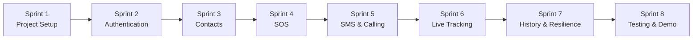

# KAAVAL MVP Sprint Implementation Plan v1.0

**Status:** Proposed tracking plan  
**Supersedes:** The schedule in `KAAVAL_MVP_ENGINEERING_IMPLEMENTATION_PLAN_v1.0.md`  
**Scope:** Approved KAAVAL MVP only; no implementation code

## Sprint Model

Each sprint produces a working, testable increment on a physical Android device. The sequence is intentionally dependency-driven: no tracking before safe alerting, and no external alerting before the SOS state machine is dependable.

| Sprint | Outcome | Status | Estimate |
|---:|---|:---:|---:|
| 1 — Project Setup | Project foundations, feasibility decisions, CI, accessible shell | ✅ **Completed** | 1 week |
| 2 — Accessibility & Engines | High-contrast theme, TalkBack semantics, Voice & Haptic engines | ✅ **Completed** | 1 week |
| 3 — Contacts | Emergency contact management and Primary Contact | 🔄 In Progress | 1 week |
| 4 — SOS | Safe accessible hold/countdown/cancel workflow | ⏳ Pending | 1–1.5 weeks |
| 5 — SMS & Calling | Alert all contacts and initiate primary-contact calling | ⏳ Pending | 1.5–2 weeks |
| 6 — Live Tracking | Secure, time-limited tracking link and location updates | ⏳ Pending | 2–3 weeks |
| 7 — History & Resilience | Mark-safe, expiry, event history, and recovery | ⏳ Pending | 1 week |
| 8 — Testing & Demo | Hardening, accessibility validation, signed test release, demo | ⏳ Pending | 2 weeks |

**Estimated duration:** 10.5–12.5 weeks for one developer. The sequence matters more than an exact calendar date; Sprint 1 must resolve the SMS/calling and offline-link feasibility gates.

## Sprint 1 — Project Setup

**Goal:** Create a safe development foundation and remove known platform blockers.

**Work**

- Create Kotlin/Compose Android project, Gradle version catalog, module boundaries, Hilt, CI, code formatting, static analysis, and test scaffold.
- Configure Firebase, Maps, environment separation, secrets handling, budget alerts, and least-privilege project access.
- Set up Crashlytics, privacy-safe logging, Firebase Emulator Suite, and internal test distribution.
- Build the accessible app shell with English/Malayalam resource support and basic TalkBack navigation.
- Obtain physical Android/SIM test devices.
- Resolve and document: Google Play emergency-SMS declaration path, automatic call-initiation behavior, secure-link behavior without internet, retention/deletion rules, and supported Android-device matrix.

**Definition of Done**

- CI builds, tests, and analyzes every pull request.
- App installs on a physical device and its initial navigation is TalkBack-tested.
- No secret is in Git; development and production environments are separate.
- All four feasibility decisions are documented as ADRs or explicit accepted risks.

**Testing and deliverables**

- Test build/installation, baseline UI semantics, Firebase emulator connection, and on-device SMS/call/location feasibility.
- Deliverable: working project shell, CI pipeline, environment checklist, ADRs, and device test matrix.

## Sprint 2 — Authentication

**Goal:** Give the user an accessible account and persistent profile.

**Work**

- Implement Firebase Phone Authentication and accessible OTP entry/retry feedback.
- Create authenticated user profile read/write flow.
- Implement server/data rules so users access only their own profile.

**Definition of Done**

- A user can sign in, return to an existing account, and recover from a failed OTP attempt.
- No account or profile data is exposed across users.
- The flow works with TalkBack and localized English/Malayalam strings.

**Testing and deliverables**

- Unit, Compose UI, and Emulator Suite security-rule tests; physical-device TalkBack/OTP test.
- Deliverable: tested authentication/profile flow and security-rule report.

## Sprint 3 — Emergency Contacts

**Goal:** Let an authenticated user configure the people KAAVAL must contact.

**Work**

- Add contact model, data access, and user ownership rules.
- Implement accessible add, edit, delete, and validation flows.
- Implement selection of exactly one Primary Emergency Contact.
- Prevent use of the SOS workflow until a Primary Contact is configured; communicate that requirement accessibly.

**Definition of Done**

- Users can manage saved contacts and choose one Primary Contact.
- Contacts are private to their owner; phone numbers are not logged.
- Empty/error states are clear with TalkBack.

**Testing and deliverables**

- Contact validation unit tests, authorization-rule tests, Compose UI tests, and physical TalkBack check.
- Deliverable: complete contact setup flow and test evidence.

## Sprint 4 — SOS

**Goal:** Build a safe, accessible emergency trigger before connecting it to real SMS/calling.

**Work**

- Implement pure Kotlin emergency state machine.
- Build large SOS control, three-second hold detection, five-second countdown, and cancellation.
- Add TalkBack status, voice guidance, haptics, large-text/high-contrast behavior.
- Persist active emergency state locally before external side effects exist.
- Recover state after process interruption.

**Definition of Done**

- Early release never activates an emergency.
- Cancellation prevents activation.
- Countdown completion creates exactly one local active event.
- The workflow is usable with TalkBack and does not rely on visual information alone.

**Testing and deliverables**

- Exhaustive state-machine/timer unit tests; Compose semantic tests; device TalkBack test.
- Deliverable: device demo of the complete local SOS/cancel flow and state-machine test report.

## Sprint 5 — SMS & Calling

**Goal:** Make the approved emergency notification behavior work on real devices.

**Work**

- Implement accessible permission education and runtime permission handling.
- Implement native Android SMS adapter and call-initiation adapter behind interfaces.
- Orchestrate SMS initiation to all contacts, then primary-contact call initiation.
- Keep GPS acquisition non-blocking; report only what the app can verify.
- Persist redacted initiation outcomes in the local event.

**Definition of Done**

- A physical device initiates SMS to all saved contacts, then the approved primary-contact call behavior.
- GPS unavailability never delays SMS/call initiation.
- Permission, SIM, carrier, and initiation failures are reported truthfully and accessibly.
- Play policy compliance evidence is attached to the milestone.

**Testing and deliverables**

- Fake-adapter unit tests; instrumented permission tests; multi-SIM/carrier physical tests; PII-log review.
- Deliverable: end-to-end alert/call device demo, policy evidence, and test results.

## Sprint 6 — Live Tracking

**Goal:** Enable secure temporary location sharing for an active emergency.

**Work**

- Implement Firestore event/tracking-session models and security rules.
- Build Cloud Functions for token issue/validation, session closure, and expiry.
- Build accessible recipient tracking page with textual location, map, and external navigation link.
- Implement Fused Location Provider and compliant foreground location service.
- Upload location idempotently; use approved offline behavior; revoke access at mark-safe/60 minutes.

**Definition of Done**

- Recipients without accounts can use a secure opaque link to see only the active event’s latest location.
- Location unavailability does not delay the alert/call path.
- Tracking stops and the link becomes invalid when marked safe or after 60 minutes.
- No cross-user, expired-token, or unauthorized tracking access is possible.

**Testing and deliverables**

- Emulator tests for Functions/rules/tokens; physical GPS/network/background tests; browser/screen-reader tracking-page test.
- Deliverable: full SOS-to-tracking-to-safe demonstration and backend security test report.

## Sprint 7 — History & Resilience

**Goal:** Complete the lifecycle and make it dependable after interruptions.

**Work**

- Implement mark-safe and automatic 60-minute expiry.
- Implement accessible event history and details.
- Reconcile local durable state with Firebase after restart, network restoration, and process interruption.
- Implement approved retention/deletion behavior.

**Definition of Done**

- User can end tracking by marking safe; expiry works without user action.
- History truthfully shows event state and does not create duplicates.
- Active-event recovery works after the defined interruption scenarios.

**Testing and deliverables**

- Unit/integration tests for expiry, closure, idempotency, and reconciliation; physical background/restart tests.
- Deliverable: full emergency lifecycle and resilience test report.

## Sprint 8 — Testing & Demo

**Goal:** Produce a credible, tested internal-release candidate and mentorship demonstration.

**Work**

- Run full regression, security, privacy, accessibility, localization, device, and poor-network testing.
- Fix critical/high issues only; log scope additions as post-MVP backlog.
- Test TalkBack, focus order, dynamic text, contrast, touch targets, English/Malayalam, and recipient tracking page accessibility.
- Build signed release candidate; distribute through Firebase App Distribution and/or Google Play Internal Testing.
- Prepare privacy disclosures, Data Safety information if publishing, release notes, demo script, tester guide, and feedback form.

**Definition of Done**

- Every approved MVP acceptance criterion is demonstrated in a signed release build or has an explicit approved limitation.
- No critical/high defect remains open.
- Mandatory real-device SMS, call, GPS, tracking, background, and TalkBack tests pass.
- No sensitive location/contact/token/SMS data appears in telemetry.
- Demo can be repeated reliably from the written script.

**Testing and deliverables**

- Full regression suite, signed-build smoke test, manual end-to-end test script, accessibility audit, privacy/security checklist.
- Deliverable: release candidate, demo guide, release notes, known-limitations register, and test report.

## Git and Quality Rules for Every Sprint

- Use protected `main` and short-lived branches named `feature/s<no>-<description>`, `fix/s<no>-<description>`, `docs/<description>`, or `chore/<description>`.
- Each pull request includes test evidence plus accessibility and privacy/security impact notes.
- CI must pass before merge. A solo developer performs a written self-review until a second contributor is available.
- No new feature enters a sprint unless it belongs to the approved MVP scope; record all other ideas in the Phase 2 backlog.
- Do not move to the next sprint with unresolved critical/high defects or untested changes to the emergency flow.

## Sprint Completion Checklist

Every sprint closes only after:

1. Its Definition of Done is met.
2. CI passes.
3. Required physical-device checks are recorded.
4. TalkBack is tested for changed user flows.
5. Privacy/security impact is reviewed when data, permissions, tracking, or telemetry changes.
6. Scope remains unchanged, or an approved versioned scope change exists.

---

This sprint plan keeps the same engineering standards as the original implementation plan, but presents progress as eight visible, working increments suited to a student project.
